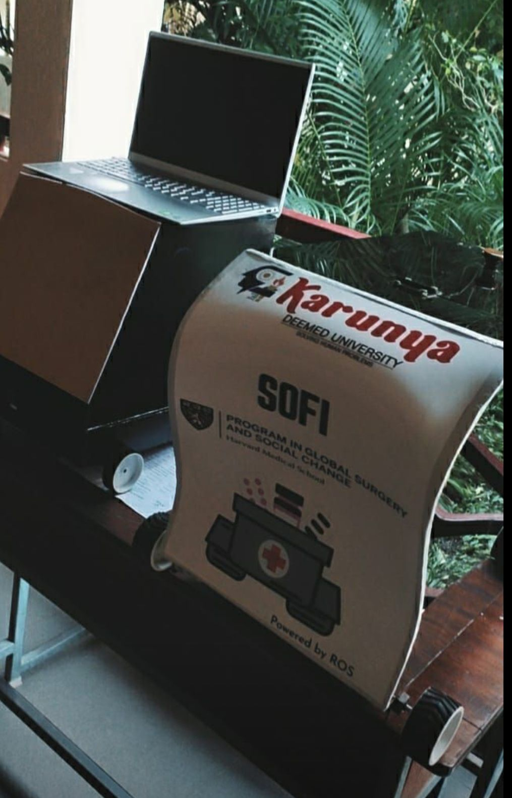
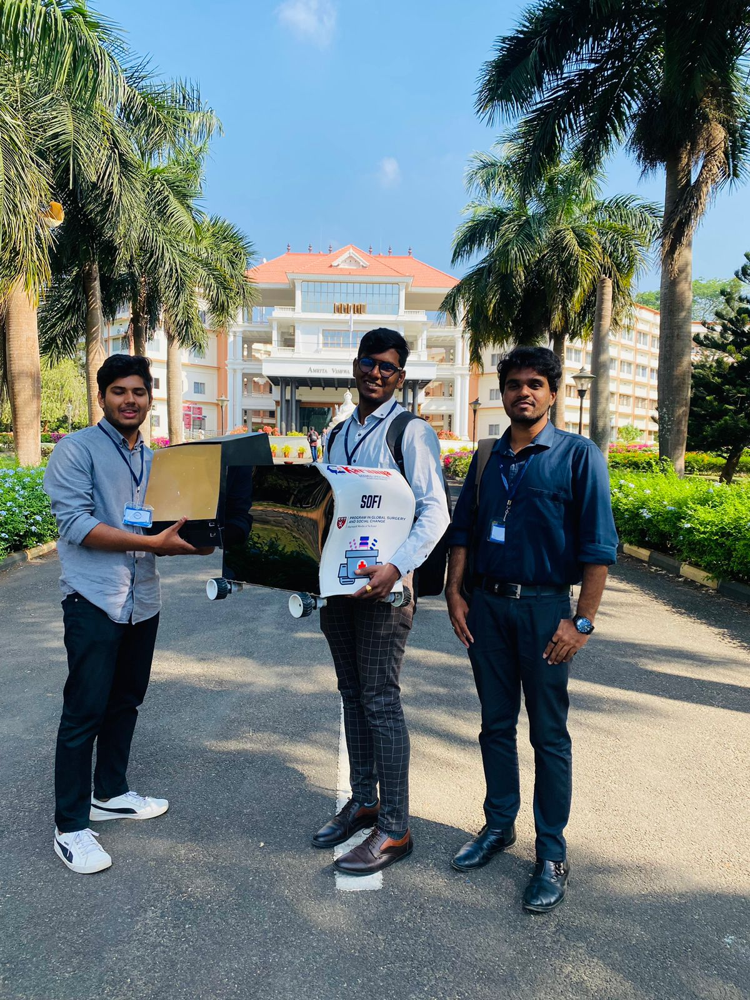
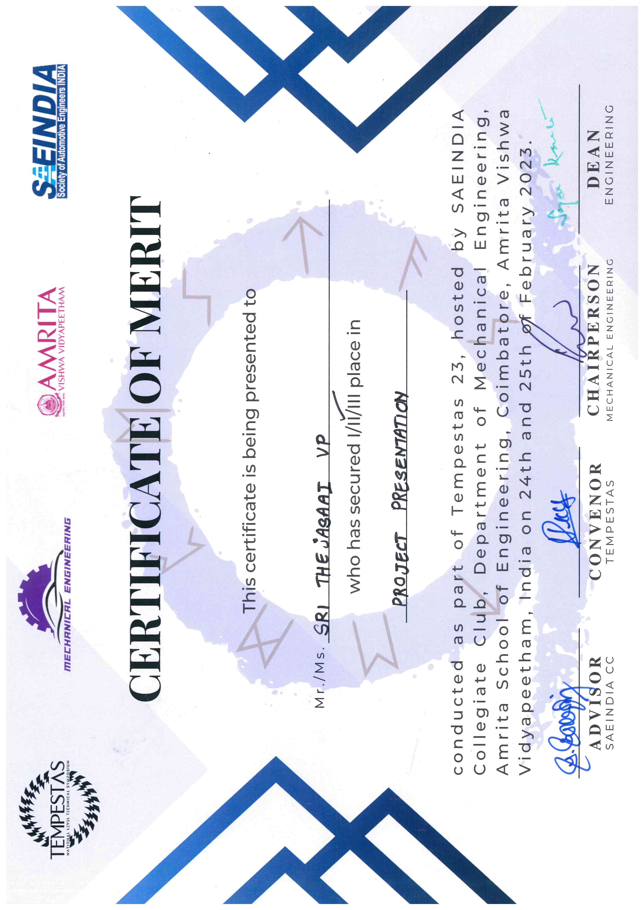
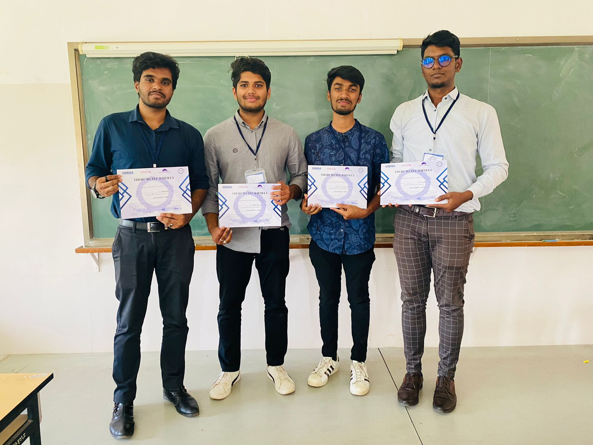
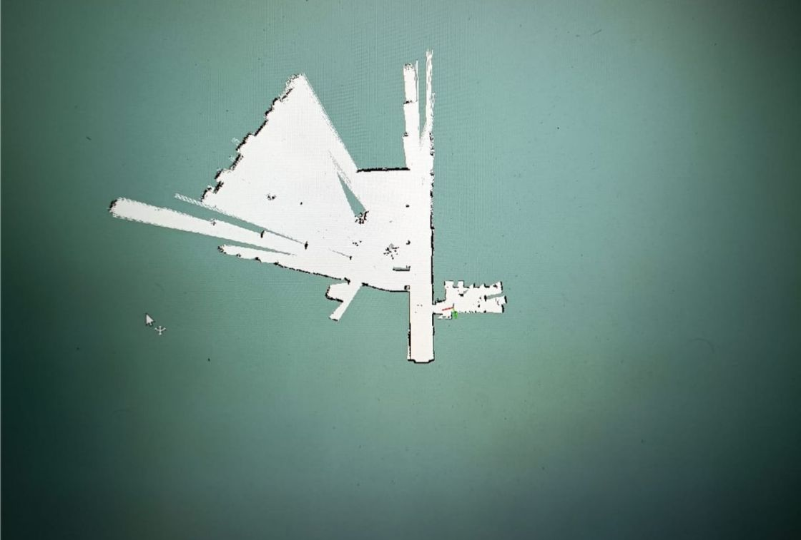
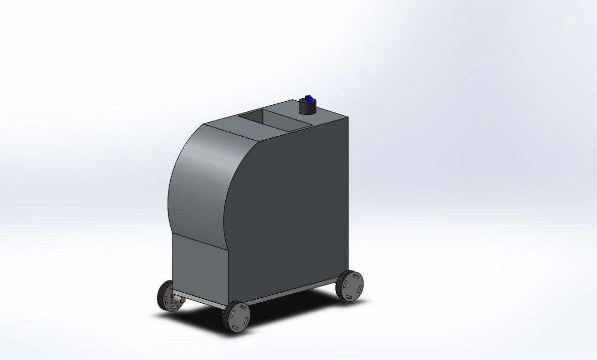

# **Medical Delivery Robot**

## **Overview**
- The Medical Delivery Robot is a ROS-based autonomous robot designed to deliver medicines 
to patient rooms in a hospital setting. By leveraging advanced technologies such as computer vision, 
SLAM (Simultaneous Localization and Mapping), and autonomous navigation, this project aimed to enhance 
safety and efficiency in healthcare workflows while reducing the need for human intervention in routine tasks.

## **Features**
- Autonomous navigation using Robot Operating System (ROS).
- **Hector Mapping (SLAM)** for real-time localization and mapping.
- Teleoperation for initial control using *teleop_twist_keyboard*.
- Computer vision integration for precise room identification and delivery.
- Designed to navigate and operate in dynamic and unpredictable hospital environments.

## **Key Achievements**
- 🏆 Second Place at the project competition hosted by Amrita College of Engineering, Coimbatore, India.
- The project later secured funding from the Program in Global Surgery and Social Change, Harvard Medical School,
  recognizing its potential in healthcare innovation.
- Successfully demonstrated a ROS-based robot capable of autonomous medicine delivery.
- Represented the project in a competitive setting, gaining recognition for innovation and technical expertise.
  
*Note:* While I was not directly involved in securing the funding, I take pride in contributing to the 
foundational work that showcased the project's value and impact.

## **What I Learned**
- Gained proficiency in Robot Operating System (ROS), including SLAM, navigation, and teleoperation.
- Enhanced understanding of computer vision and its integration with autonomous systems.
- Improved collaborative and project management skills by working in a multidisciplinary team.
- Developed technical presentation and public speaking abilities by showcasing the project at competitions.

# **Project Summary**

## **Introduction**
The Medical Delivery Robot is a groundbreaking initiative to enhance the efficiency and safety of healthcare workflows. 
This project utilized ROS, computer vision, and autonomous navigation to automate the delivery of medicines in hospitals, 
ensuring a seamless workflow and minimizing human contact.

## **Objectives**
- Automate medicine delivery to patient rooms, reducing human intervention in routine tasks.
- Enhance safety and efficiency in hospital environments.
- Demonstrate the feasibility of using ROS-based solutions in real-world healthcare applications.

## **Technical Implementation**
**1. ROS Integration:**
- Utilized ROS for autonomous navigation, sensor integration, and system control.
- Integrated ROS packages to manage motion planning and SLAM.

**2. Hector Mapping (SLAM):**
- Implemented Hector Mapping for real-time localization and mapping.
- Used ros_map_server to save maps for efficient navigation.

**3. Teleoperation:**
- Operated the robot manually during testing using teleop_twist_keyboard.

**4. 3D Model and Assembly:**
- Designed a 3D model of the robot and assembled it for optimal functionality in a healthcare setting.

**5. Computer Vision:**
- Integrated algorithms for room detection to ensure precise delivery.

## **Future Scope**
- Integration with IoT systems for centralized monitoring and control.
- Enhanced patient interaction using voice commands and feedback systems.
- Optimization of SLAM and path-planning algorithms for better precision.

## **Acknowledgement**
- This project was a collaborative effort undertaken as part of a group initiative. While I played a
  significant role in its development and presentation, I do not claim ownership or exclusive rights
  to the project. It has since been further developed by the team, and I respect the collective
  contributions and innovation of all members.

## **Disclaimer**
- This repository is intended solely as a showcase of my contributions to the project and the skills
  I developed during its execution.
- No proprietary code or designs are included to honor the collaborative nature of the project
  and its ongoing development.
- The content shared here reflects my personal learning and achievements, such as gaining expertise in ROS,
  SLAM, and autonomous navigation.

## **Images**

